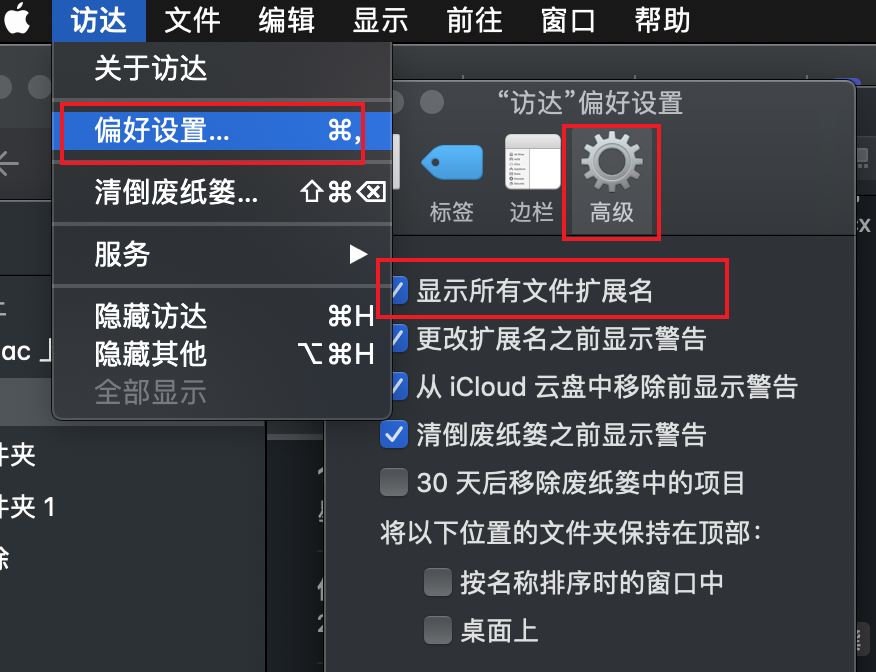

## Mac命令
### 安装 n 包管理node升级
npm i -g n --force

### 更新对应版本命令
sudo n 13.4.0

### Git切换源
github克隆项目的时候，如果非公司环境网络，下载失败，可以选择下面命令行，从ssh切换到http
```
git remote set-url origin <要修改的url>
```


### Mac 命令行
#### Mac打开tar.gz文件命令行
```
  tar -xzvf xxx.tar.gz
```
#### 删除某个文件
```
  rm -rf <文件名字>
```
#### 编辑文件
```
 vim .git/config
```

### 退出编辑
```
1、esc
2、；
3、wq
```
### 修改hosts文件
```
1，打开访达，设置文件展示所有扩展文件；
2，长按左键finder，前往文件夹，输入/etc/
3，查找hosts文件编辑
4，命令行方式 vim /etc.hosts
```
### 修改访达文件，设置展示扩展文件


### ios系统安装ipa文件
```
1、打开Xcode，选择windows-Devices and Simulators；
2、点击+选择本地ipa文件，等待手机安装完成则可；
```