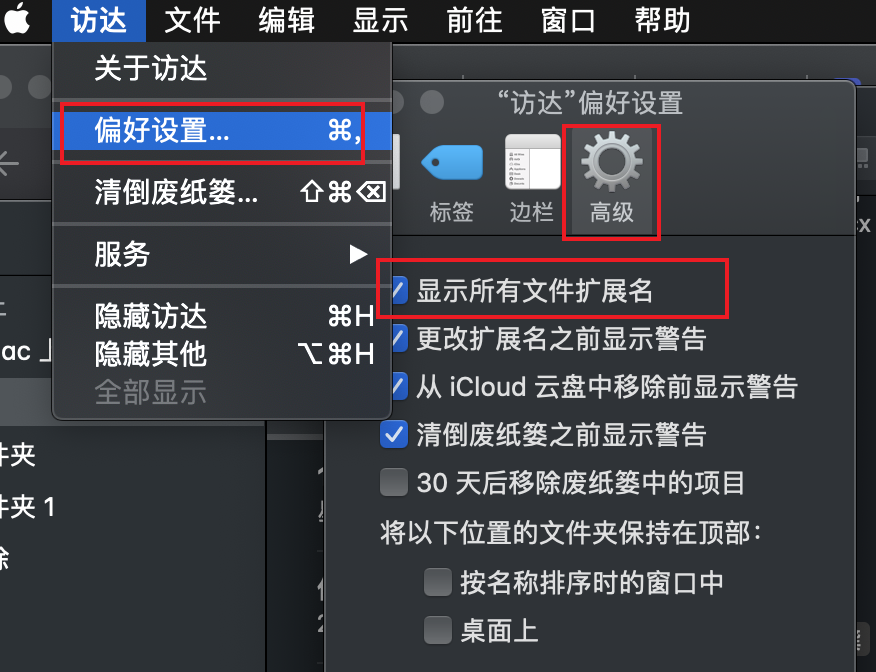

###  mac设置中文输入法
```
1、打开系统偏好设置--选择键盘--输入法
2、左下角+箭头新增“简体中文输入法”，添加
3、设置输入法最底部全选
https://jingyan.baidu.com/article/219f4bf73b5faa9f452d3871.html
```

```
### 修改hosts文件
```
1，打开访达，设置文件展示所有扩展文件；
2，长按左键finder，前往文件夹，输入/etc/
3，查找hosts文件编辑
4，命令行方式 vim /etc.hosts
```
### 修改访达文件，设置展示扩展文件


### ios系统安装ipa文件
```
1、打开Xcode，选择windows-Devices and Simulators；
2、点击+选择本地ipa文件，等待手机安装完成则可；
```

### Mac终端工具iTerm安装

### charles安装和破解


### ps的安装和破解
1、adoble官网下载photoshop，下载完毕双击下载的ps文件
2、进入photoshop安装程序界面，


### vscode