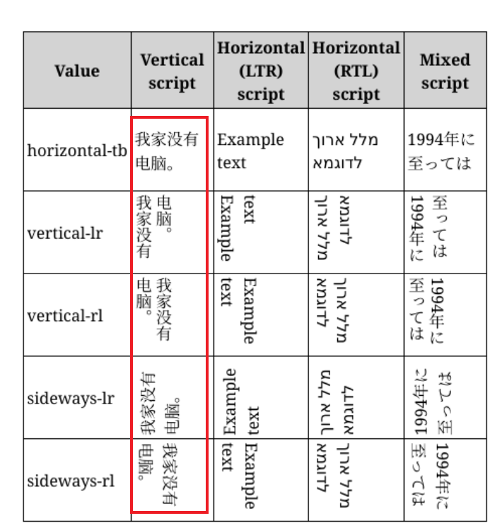

## css特殊属性
### writing-mode用法
该属性定义了文本水平或垂直排布以及在块级元素中文本的行进方向。为整个文档设置书时，应在根元素上设置它（对于 HTML 文档应该在 html 元素上设置）。 它采用以下值之一horizontal-tb (default) | vertical-rl | vertical-lr


###  设置input标签的placeholder颜色(移动端只需要适配webkit内核即可)
```
input::-webkit-input-placeholder,
textarea::-webkit-input-placeholder {
    color: #9e9e9e;
}

```

### object-fit 设置元素在容器中展示
属性值：fill，cover 。。。
可用于图片设置展示方式 类似于background：contain，cover

### object-position 设置元素在容器中展示起点位置
类似于background-position

